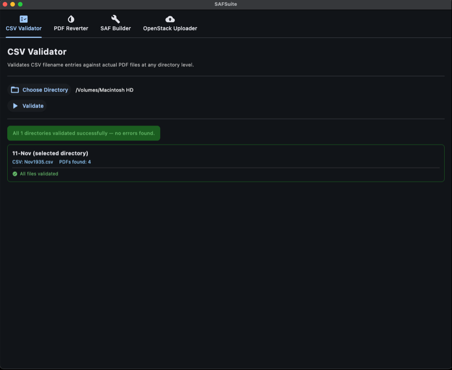
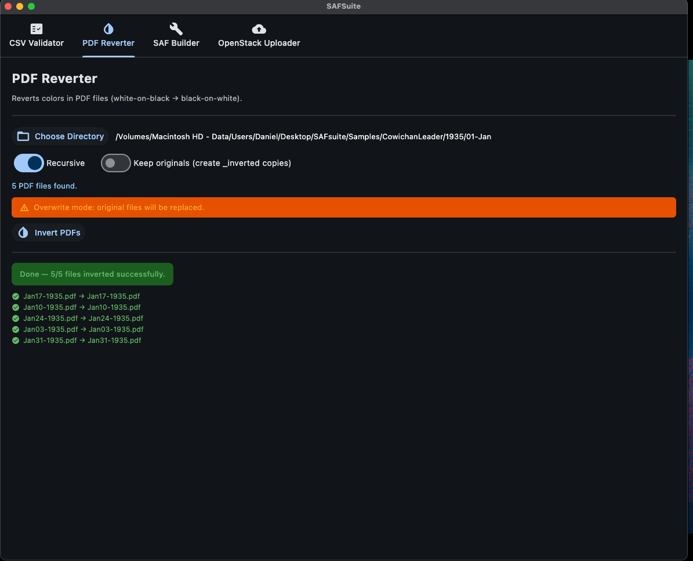
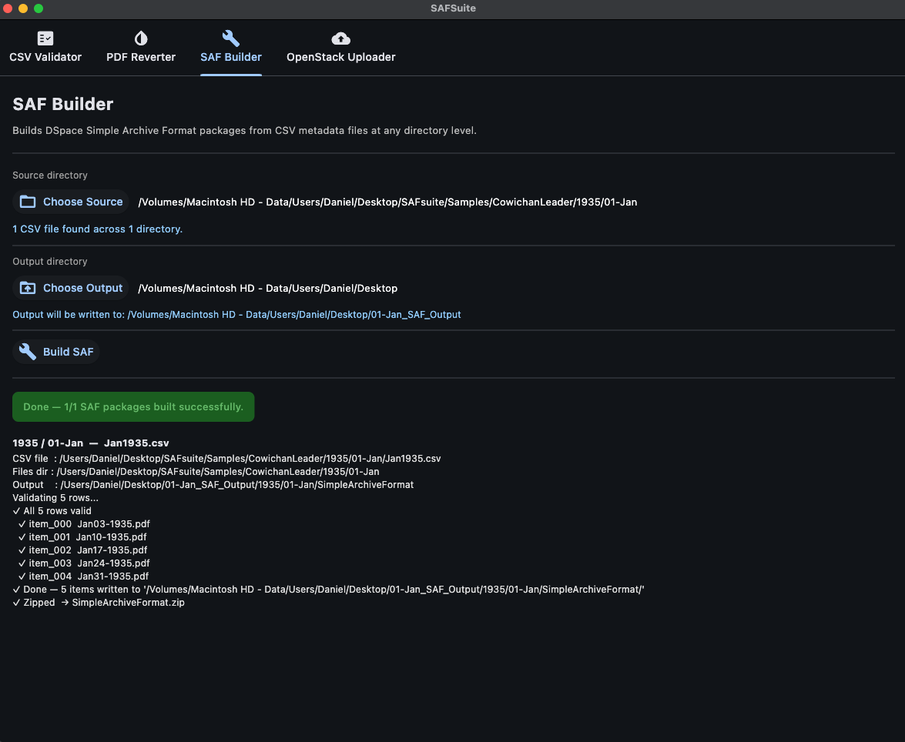
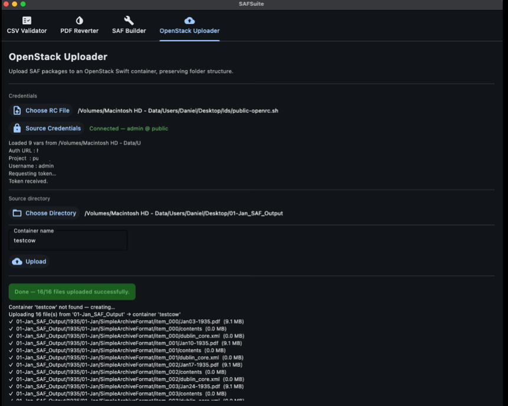

# SAFsuite

A Python/Flet application for processing and validating Simple Archive Format (SAF) packages, designed for digital archive management and DSpace repository workflows. Inspired by the [SAFBuilder](https://github.com/DSpace-Labs/SAFBuilder)


### 📋 CSV Validator



- **Validates CSV files** against corresponding PDF files in directory structures
- **Identifies missing files** and inconsistencies between metadata and actual content
- **Supports hierarchical directory structures** (year/month organization)
- **Comprehensive error reporting** with categorized issue types
- **Batch validation** across multiple directories

### 📄 PDF Reverter



- **Color inversion** for PDF files (converts white text on black background to black text on white)
- **Batch processing** with recursive directory scanning
- **Flexible output options** (overwrite originals or create new copies)
- **Progress tracking** for large file sets
- **Error handling** with detailed status reports

### 🏗️ SAF Builder

- **Creates DSpace Simple Archive Format packages** from CSV metadata files
- **Automated package generation** for multiple directories/months
- **Dublin Core metadata mapping** from CSV columns
- **Batch processing** for entire year/month hierarchies
- **Organized output structure** with proper SAF formatting


### 🏗️ OpenStack Uploader

- For distributed teams that need to share these files prior to importing into dpsace
- **Sources API credentials** see this doc on - [Setting environment variables using the OpenStack RC file](https://docs.openstack.org/newton/user-guide/common/cli-set-environment-variables-using-openstack-rc.html) for more details
- **Creates containers** if needed
- **Segemented uploads** if needed
- **Progress tracking** for large file sets
- **Error handling** with detailed status reports


## Installation

### Requirements
- Python 3.7+
- Required packages:
```bash
pip install flet PyMuPDF python-swiftclient
```

### Run the Application
```bash
python SAFsuite.py
```

## Usage

### 1. CSV Validator Tab
1. Click **"Choose Directory"** to select any directory containing CSV and PDF files
2. Works with any structure - select at any level (top-level, year folder, month folder, etc.)
3. Click **"Validate"** to check CSV files against PDF files
4. Review results showing:
   - Missing PDF files referenced in CSV
   - PDF files not listed in CSV
   - Empty or malformed CSV entries
   - Success confirmations for valid directories

### 2. PDF Reverter Tab
1. Click **"Choose Directory"** to select directory containing PDF files
2. Configure options:
   - **Recursive**: Process subdirectories
   - **Keep originals**: Create `_inverted` copies instead of overwriting
3. Click **"Invert PDFs"** to process all PDF files
4. Monitor progress and review results

### 3. SAF Builder Tab
1. Click **"Choose Source Directory"** - select any directory containing your CSV files
2. Click **"Choose Output Directory"** - where SAF packages will be created
3. The tool automatically finds CSV files at any depth in your directory structure
4. Review the detected CSV files count
5. Click **"Build SAF"** to generate Simple Archive Format packages
6. Each directory with a CSV file will be processed into individual SAF packages

### 4. Open Stack Uploader Tab
1. Click **"Choose RC File"** - to locate your `public-openrc.sh`API credentials
2. Click **"Source Credentials"** - enter your password/login
3. Click  **"Choose Directory"** - to locate the files you wish to upload
5. Add a **"Container name"** to name and/or create a container
6. Upload your files


## Directory Structure

The application works with **flexible directory structures**. You can organize your files how you like.


### CSV Format Requirements
- Must contain a `filename` column referencing PDF files
- Additional columns should use Dublin Core naming (e.g., `dc.title`, `dc.date.issued`)
- Language qualifiers supported (e.g., `dc.publisher[en]`)

## Individual Tool Usage

The `Deconstructed/` directory contains standalone versions of each tool:

### reverter.py
```bash
python Deconstructed/reverter.py [directory] [--recursive]
```

### safBuilder.py
```bash
python Deconstructed/safBuilder.py metadata.csv [--output output_directory]
```

### dircleaner.py
```bash
python Deconstructed/dircleaner.py [/path/to/dir]
```


## Features

- **Modern GUI**: Built with Flet for cross-platform compatibility
- **Progress tracking**: Real-time feedback for long-running operations
- **Error categorization**: Different types of validation issues clearly identified
- **Batch processing**: Handle multiple files and directories efficiently
- **Thread-safe operations**: Non-blocking UI during file processing

## Sample Workflow

1. **New Archive Processing**:
   - Run CSV Validator to ensure data integrity at any directory level
   - Use PDF Reverter to fix color issues across any folder structure
   - Generate SAF packages with SAF Builder from any organized structure
   - Upload your files to OpenStack if needed

## Troubleshooting

- **"No CSV files found"**: Ensure your selected directory (or its subdirectories) contains CSV files
- **PDF processing errors**: Check file permissions and disk space
- **Large file timeouts**: Process directories in smaller batches
- **Memory issues**: Close other applications when processing many large PDFs
- **Structure confusion**: The tools work with ANY directory organization - just point them at your files

